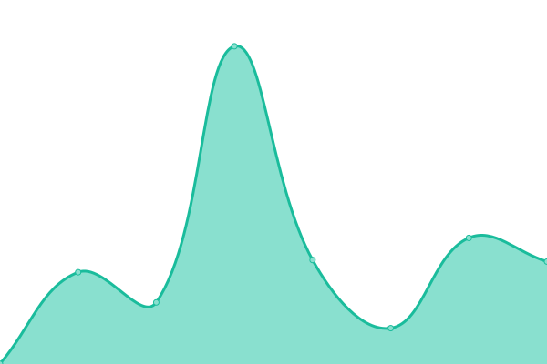

# [📈 Live Status](https://kamleshpaul.github.io/codingtricks.co-uptime): <!--live status--> **🟩 All systems operational**

This repository contains the open-source uptime monitor and status page for [codingtricks.co](https://codingtricks.co), powered by [Upptime](https://github.com/upptime/upptime).

<!--start: status pages-->
<!-- This summary is generated by Upptime (https://github.com/upptime/upptime) -->
<!-- Do not edit this manually, your changes will be overwritten -->
<!-- prettier-ignore -->
| URL | Status | History | Response Time | Uptime |
| --- | ------ | ------- | ------------- | ------ |
|  [Codingtricks](https://codingtricks.co/) | 🟩 Up | [codingtricks.yml](https://github.com/Kamleshpaul/codingtricks.co-uptime/commits/HEAD/history/codingtricks.yml) | 

 202ms
     
 | 

<a href="https://kamleshpaul.github.io/codingtricks.co-uptime/history/codingtricks">100.00%</a>
    

<!--end: status pages-->

[**Visit our status website →**](https://kamleshpaul.github.io/codingtricks.co-uptime)
